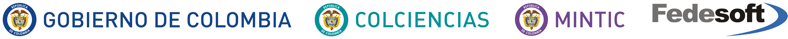

[//]: # "business-support-093-recolectapp"

  

# PROYECTO GENERACIÓN DE CAPACIDADES EN EL ECOSISTEMA DIGITAL EN BOGOTÁ 

# RETO: Reciclar para respirar.

¿Cómo podemos mejorar la recolección de residuos (plásticos, vidrio, cartón...)?

Propuesta,

 

  
 

RecolectApp es una aplicación móvil que busca revolucionar el proceso de reciclaje, facilitando la recolección de residuos desde los hogares, e integrando dentro de la comunidad a la población recicladora.

<h2>&nbsp;Documentación</h2> [+](1-Documentacion)

Acá encontrará toda la documentación del proyecto, relacionada con las siguientes temáticas:

-> Análisis (Requerimientos funcionales y no funcionales, análisis de negocio, casos de uso).

-> Arquitectura y diseño (Componentes de infraestructura, componentes de la aplicación, interfaz gráfica).

-> Modelo de datos (estructura de la base de datos, diccionario de datos, modelo relacional).

## Código Fuente [+](2-Codigo_Fuente)

Contiene el código fuente del backend y el frontend de la aplicación.

## Aplicación [+](3-Aplicacion)

Detalle del apk y link de descarga de la aplicación móvil.

## Página Web [+](4-Landing_Page)

Contiene el HTML y CSS de la landing page.

